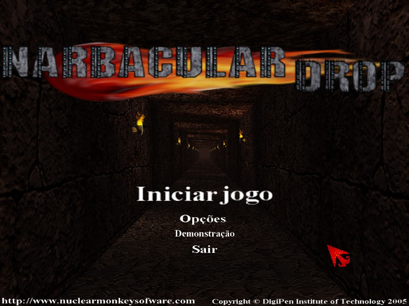
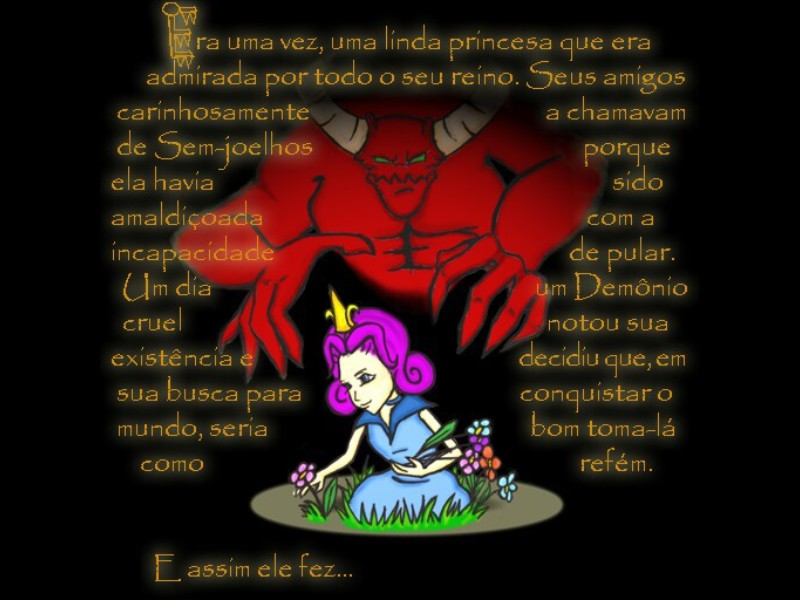
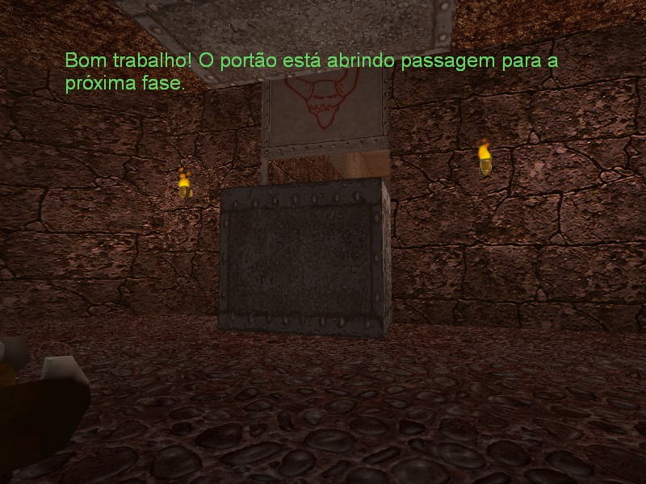
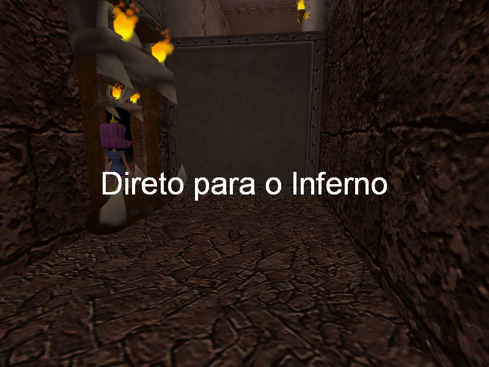

# About the Translations
## Portuguese (Brazil) Translation
More detailed information about the project can only be found in the [Portuguese documentation](PT-BR/Documentação.md).
## Progress
| Language  | Texts | Textures | Menus |
| --------- | ----- | -------- | ----- |
| Portuguese (Brazil) | ✅ 100% | ✅ 100% | 🟨 50% |
- ⚠️ The menu cannot be fully translated, since its texts are part of a `menus.dds` texture, which already has the size and position of the texts defined, and so far we haven’t been able to change that.

## Images

  
  
  
  

## Credits
### Source BR:

**Menino David** – Proofreading, translation, and graphic editing  

**Jv132** – Proofreading and translation  

**AG1** – Story translation