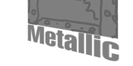
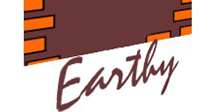

# Fonts Used
Here are all the fonts that were used in the project. In addition, we must keep in mind that the game is from 2005, so the fonts used in the textures cannot be more recent than that.

| Font | Example | Details |
| ------| ------- | ------- |
| Papyrus |  | Font used to tell the story, but the initial letters are still a mystery. |
| Dauphin-Normal |  | Font used for the menus, and also used in the [manual](https://ia902906.us.archive.org/24/items/narbacular_drop_20190420/narbacular_drop_instruction_manual.pdf). |
| Impact |  | Font used for the menus over metallic surfaces. |
| Stucco |  | Font used for the menus over earthy surfaces. |

<strong>Documentation</strong>

  <a href="Programs.md">← Tools Used</a>
  &nbsp;&nbsp;&nbsp;|&nbsp;&nbsp;&nbsp;
  <a href="Translate.md">How to Translate →</a>

