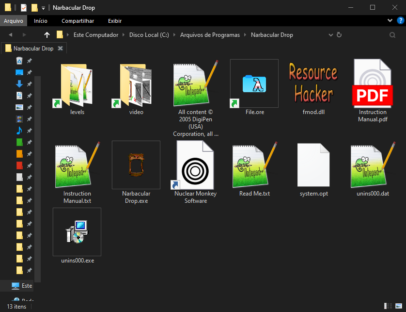

# Modifying the Game

The game files are stored inside `File.ore`. To insert the translation, you can either modify the `.ore` using a hex editor, or simply recreate the folder structure of the `.ore` inside the Narbacular Drop executable folder.

### Structure of `File.ore`:


```
File.ore
├── files/
│   ├── audio
│   ├── levels
│   └── video
```
We can see that there are 3 main folders: `audio`, `levels`, and `video`.  
- The `audio` folder contains the game’s sounds and music, which is not useful here since there’s nothing to dub.  
- The `levels` folder contains the `.cmf` map files, where the game’s texts are stored.  
- The `video` folder contains the game’s textures in `.jpg`, `.bmp`, and `.dds` formats.  

With this in mind, we can start modifying the game. I won’t cover the hex editing method, since it’s unnecessary and more complicated.

Go to the folder where Narbacular Drop is installed (usually `C:/Program Files(x86)/Narbacular Drop`) and create the folders that exist inside the `.ore`. In this case, only `levels` and `video`.



As you can see, I created symbolic links for the `levels` and `video` folders from the repository located in `PT-BR/Traduzido`. From this point on, the game will prioritize the files inside these folders instead of the `.ore`. It works similarly to the “custom” folder in Source games.

<hr />

<p align="center"><strong>Documentation</strong></p>

<p align="center">
  <a href="Translate.md">← How to translate</a>
  &nbsp;&nbsp;&nbsp;|&nbsp;&nbsp;&nbsp;
  <a href="Documentation.md">Back to documentantion →</a>
</p>