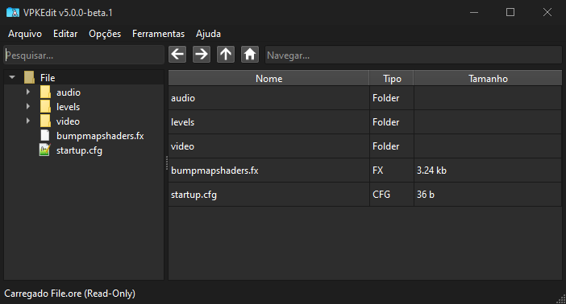

# Modificando o jogo

Os arquivos do jogo ficam dentro do `File.ore`, para você conseguir inserir a tradução, você pode tanto modificar o `.ore` utilizando hexadeximal, ou simplismente recriando a estrutura de pastas do `.ore` na pasta do executável do Narbacular Drop.

### Estrutura do `File.ore`:


```
File.ore
├── files/
│   ├── audio
│   ├── levels
│   └── video
```
Podemos notar que há 3 pastas principais, `audio`, `levels` e `video`, em que na pasta áudio tem os sons e músicas do jogo, não tem útilidade pois não há nada para dublar, na levels possui os arquivos dos mapas `.cmf`, em que contém os textos do jogo, e na video, temos as texturas do jogo em `.jpg`, `.bmp` e `.dds`. Bom sabendo disso, podemos começar a modificar o jogo, não irei abordar como fazer via hexadeximal, pois não é necessário e é um metódo mais complicado.


Vá na pasta onde está o Narbacular Drop, costuma ser `C:/Arquivos de Programas(x86)/Narbacular Drop` e crie as pastas que existem dentor do `.ore`, no caso apenas `levels` e `video`.


Como se pode notar, no caso, criei links simbolicos das pastas `levels` e `video` do repositório que estão na pasta `PT-BR/Traduzido`, a partir desse momento, o jogo irá dar prioridade para os arquivos dentro das pastas ao invés do `.ore`, é como se fosse a pasta custom da Source.

<hr />

<p align="center"><strong>Documentação</strong></p>

<p align="center">
  <a href="Traduzir.md">← Como traduzir</a>
  &nbsp;&nbsp;&nbsp;|&nbsp;&nbsp;&nbsp;
  <a href="Documentação.md">Voltar para a documentação →</a>
</p>