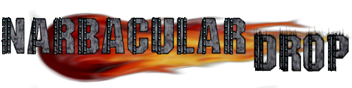
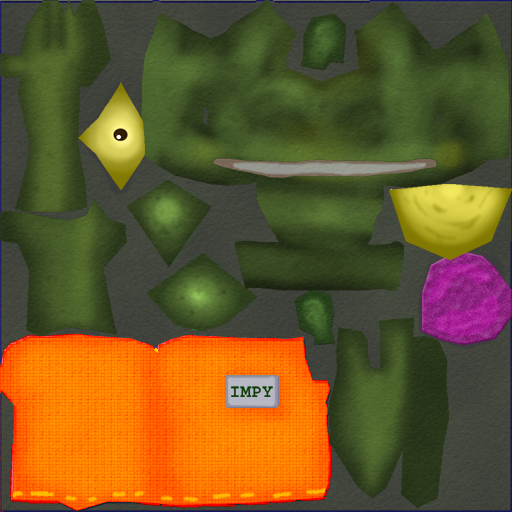

# Texturas não traduzidas
Aqui contém todas as texturas que não foram traduzidas para o português e os motivos.

## Texturas
| Textura | Original | Detalhes |
| ------- | -------- | -------- |
| dit |  | Logo na universidade, optamos por não traduzir. |
| nms |  | Logo com o nome dos desenvolvedores. |
| title |  | Logo do jogo, não traduzimos o nome do jogo, e logo, também não traduzimos a logo. |
| impy_texture |  | O nome do persogame é Impy, e não traduzimos o nome dele. |

<strong>Sobre a tradução</strong>

  <a href="Texturas.md">← Tradução das texturas</a>

