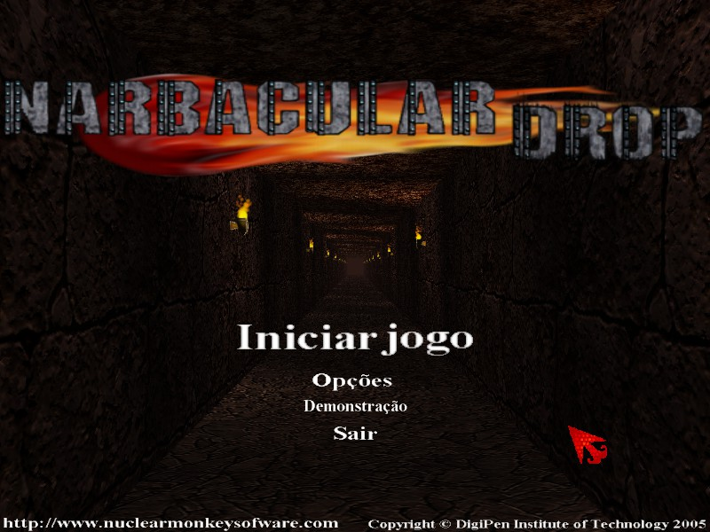
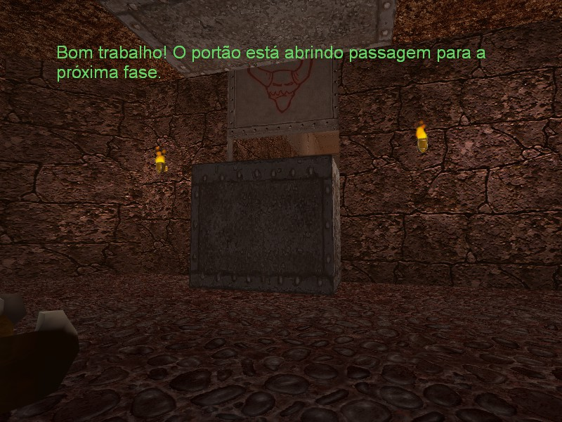

# Sobre a tradução
A tradução em português tem inspiração nas traduções feitas para a GoldSrc, mantendo termos semelhantes com algumas adaptações.

## Progresso
| Idioma | Textos | Texturas | Menus |
| ------ | ------ | -------- | ---- |
| Português | ✅ 100% | ✅ 100% | 🟨 50% |
- ⚠️ O menu não pode ser totalmente traduzido, pois os textos do menu são uma textura `menus.dds` na qual já tem o tamanho e posição dos textos definidos, e não conseguimos alterar isso até o momento.

### Você pode ver o nosso trabalho aqui
- [Comparativo da tradução](Tradução.md)
- [Comparativo das texturas](Texturas.md)
- [Texturas que não foram traduzidas](Não%20traduzidas.md)

Caso queira ver saber mais veja a [documentação](Documentação.md).

## Imagens

  
  
  
  

## Créditos
### Source BR:

**Menino David** – Revisão, tradução, e Edição gráfica 

**Jv132** – Revisão e tradução

**AG1** – Tradução da história 

<strong>Sobre a tradução</strong>

  <a href="../Readmes/Brazilian.md">← Início</a>
  &nbsp;&nbsp;&nbsp;|&nbsp;&nbsp;&nbsp;
  <a href="Tradução.md">Tradução →</a>

