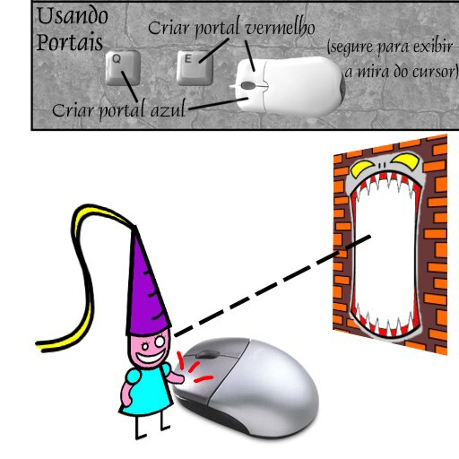

# Tradução das texturas
Aqui contém todas as texturas que foram traduzidas para o português, além de conter a comparação das texturas, trancrições e anotações sobre a qualidade e escolhas na adaptação.

## video (✅ Revisado)
| Textura | Original | Tradução | Detalhes |
| ------- | -------- | -------- | -------- |
| introscene1 | Once upon a time, there lived a beautiful princess that was admired by her whole kingdom. Her friends lovingly called her No-Knees because she was cursed with the inability to jump. One day, a cruel and evil demon took notice of her and decided that in his quest to conquer the world she would be good to take hostage. And so he did... | Era uma vez, uma linda princesa que era admirada por todo o seu reino. Seus amigos carinhosamente a chamavam de Sem-Joelhos, porque ela havia sido amaldiçoada com a incapacidade de pular. Um dia, um demônio cruel notou sua existência e decidiu que, em sua busca para conquistar o mundo, seria bom tomá-la como refém. E assim ele fez... | ✅ Tradução adaptada |
| |  |  | ℹ️ Semi-editável ✅ Perfeita  |
| introscene2 | Alas, poor Princess No-Knees was whisked away to Demon’s lair embedded deep in a mountain. She was imprisoned in a cage with only Demon’s mischievous minion, Impy, to keep her company. The situation appeared impossible, and so No-Knees despaired. Unbeknownst to her, there was someone watching who could help... | Infelizmente, a pobre Princesa Sem-Joelhos foi levada às pressas para o covil do Demônio, encravado nas profundezas de uma montanha. Ela foi aprisionada em uma jaula, tendo apenas o arteiro lacaio do Demônio, Impy, para lhe fazer companhia. A situação parecia impossível, e então Sem-Joelhos desesperou-se. Sem que ela soubesse, havia alguém observando que poderia ajudar... | ✅ Tradução adaptada |
| |  |  | ℹ️ Semi-editável ✅ Perfeita  |
| introscene3 | The spirit of the mountain, Wally, was furious at Demon for creating the lair inside his home. He saw No-Knees, took pity on her, and decided to show himself. He told No-Knees that he would help her escape from the dungeon in exchange for assistance in defeating Demon. And so, Wally revealed his power to open portals in the wall that can break reality. He began to instruct No-Knees on how to use this power to break free... | O espírito da montanha, Wally, estava furioso com o Demônio por ter criado o covil dentro de sua casa. Ele viu Sem-Joelhos, teve pena dela, e decidiu se revelar. Disse a Sem-Joelhos que a ajudaria a escapar da masmorra em troca de reforço para derrotar o Demônio. E assim, Wally revelou seu poder de abrir portais nas paredes que podem romper a realidade. Ele começou a instruir Sem-Joelhos em como usar esse poder para se libertar... | ✅ Tradução adaptada |
| |  |  | ℹ️ Semi-editável ✅ Perfeita |
| tutorial1a tutorial1b | Controls(defaults) Looking Zoom In/Out Over-the-shoulder View Look Up - Look Right - Look Left - Look Down First-Person View - Over-the-shoulder View - Third-Person View - Cycle View Moving Forward - Backward  Strafe Left - Strafe Right | Controles(padrões) Visão Aproximar/Afastar Visão por cima do ombro Olhar para cima - Olhar para direira - Olhar para esquerda - Olhar para baixo  Visão em primeira pessoa - Visão por cima do ombro - Visão em terceira pessoa - Alternar visão Movimento Para frente - Para trás Mover-se para a esquerda - Mover-se para a direita | ✅ Tradução adaptada |
| |  |  | ℹ️ Editável ✅ Ótima | 
| |  |  | ℹ️ Editável ✅ Ótima | 
| tutorial2a tutorial2b | Portaling Create Red Portal Create Blue Portal (bold to display aim cursor) | Usando Portais Criar portal vermelho Criar portal azul (segure para exibir a mira do cursor) | ✅ Tradução literal |
| |  |  | ℹ️ Editável ✅ Ótima | 
| |  |  | ℹ️ Editável ✅ Ótima | 
| tutorial3a tutorial3b | Portaling Create Red Portal Create Blue Portal (bold to display aim cursor) Eartly - Metallic | Usando Portais Criar portal vermelho Criar portal azul (segure para exibir a mira do cursor) Terrestre - Metálica | ✅ Tradução adaptada |
| |  |  | ℹ️ Editável ✅ Ótima | 
| |  |  | ℹ️ Editável ✅ Ótima | 
| menus | Play Game, Resume, Restart Level Options, Main Menu, Video, Audio Showcase Controls, OK, Cancel Quit, Bit, Volume Color, Depth, Resolution, Music Windowed, Sound Effects, Down Anti-Aliasing Walk Strafe, Turn, Look Left Right, Forward, Backward, Up Portal, Red, Blue. Camera, Fire Cycle View, Zoom, In, Out Moviment, Press a key to bind it.  | Iniciar jogo, Continuar, Reiniciar fase Opções, Menu principal, Vídeo, Áudio Demonstração, Controles, Ok, Cancelar Sair, Bits, Volume Cor Depth, Resolução, Música Modo janela, Efeitos sonoros, Down Antisserrilhado Walk Strafe, Turn, Look Left Right, Forward, Backward, Up Portal, Red, Blue. Camera, Fire Cycle View, Zoom, In, Out Moviment, Press a key to bind it. | ✅ Tradução adaptada |
| |  |  | ℹ️ Rasterizada ✅ Perfeita | 

<strong>Sobre a tradução</strong>

  <a href="Fontes.md">← Fontes utilizadas</a>
  &nbsp;&nbsp;&nbsp;|&nbsp;&nbsp;&nbsp;
  <a href="Não traduzidas.md">Texturas não traduzidas →</a>

