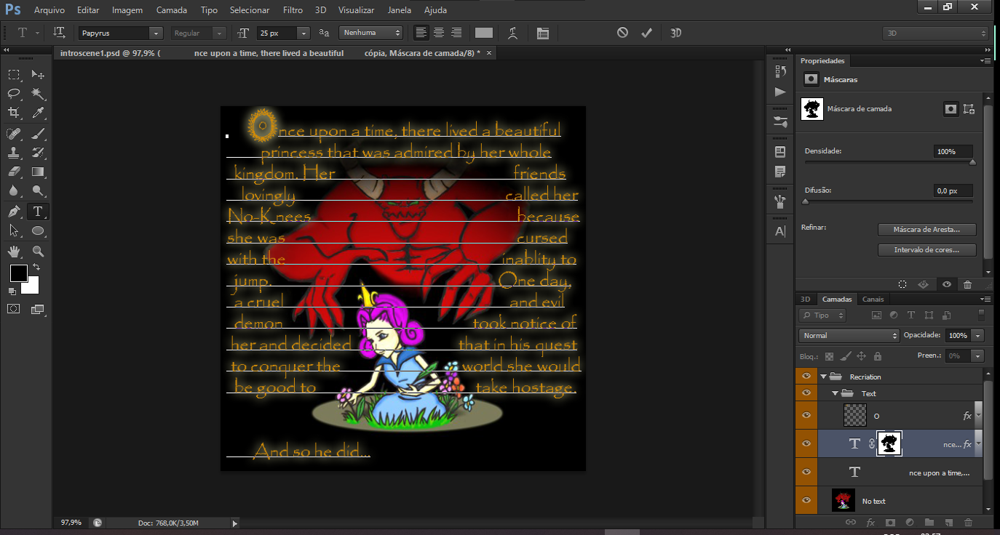
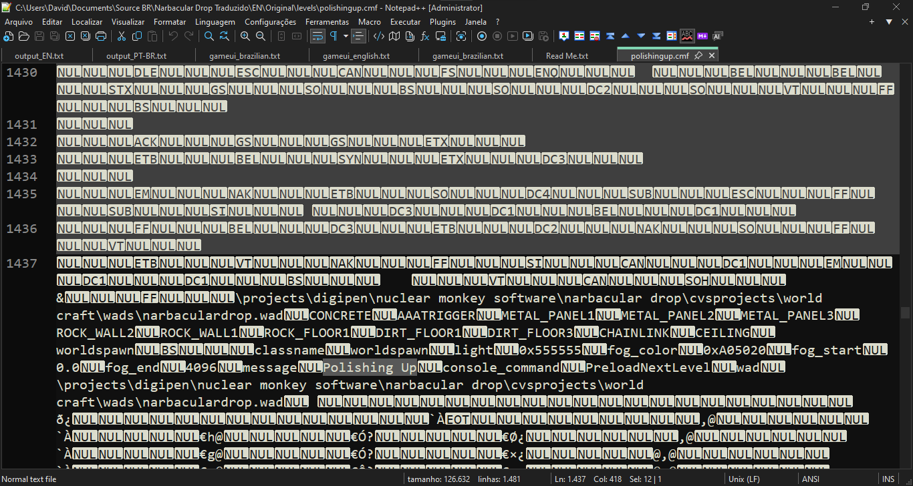

# Como traduzir
## Texturas
Crie a pasta para o idioma que você deseja traduzir na raíz, por exemplo o espanhol. Crie a pasta `ES` na raíz do repositório e dentro dela crie a pasta `Compilação` e `Traduzido` no seu respectivo idioma, no caso `Compilación` e `Traducido`, e cole a pasta `video` que está dentro de `EN/Recriation` na pasta `ES/Traducido`, agora abra os arquivos `.psd` que estão na pasta `video/psd` no Photoshop, traduza a textura e salve como `.png` na pasta `ES/Traducción/video`. 

Após isso execute o `compile.bat`, ele irá tranformar os `.png` em `.jpg` com a compressão praticamente idêntica com a textura original.

| Original | Recriada com compressão | Recriada sem compressão |
| -------- | ----------------------- | ----------------------- |
|  |  |  |

## Textos
Assim como com as texturas, cole a pasta `levels` dentro de `EN/Original` na pasta `ES/Traducido`. Os textos estão contidos dentro dos mapas, que estão na pasta `levels`, cada mapa `.cfm` contém os textos que aparecem nele, abra o mapa que deseja editar com o notepad++(ou de sua preferência) e edite os textos, e salve, todos os textos do jogo e alinha e mapa em que ele se encontra está nas [strings](../Strings.md), você pode tanto ver a linha, ou copiar o texto das strings e usar o `Ctrl+f`

<strong>Documentação</strong>

  <a href="Fontes.md">← Fontes utilizadas</a>
  &nbsp;&nbsp;&nbsp;|&nbsp;&nbsp;&nbsp;
  <a href="Modificar.md">Modificando o jogo →</a>

