# Перевод текстур

Здесь содержатся все текстуры, переведённые на русский язык, а также сравнение текстур, транскрипции и заметки о качестве и выборе при адаптации.

| Текстура | Оригинал | Перевод | Детали |
| -------- | -------- | ------- | ------ |
| title | Narbacular Drop | Капля Нарбакуляра |
| | 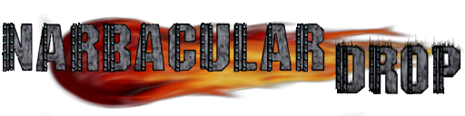 | 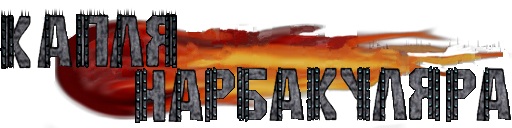 | 
| introscene1 | Once upon a time, there lived a beautiful princess that was admired by her whole kingdom. Her friends lovingly called her No-Knees because she was cursed with the inability to jump. One day, a cruel and evil demon took notice of her and decided that in his quest to conquer the world she would be good to take hostage. And so he did... | Жила-была прекрасная принцесса, которой восхищалось все ее королевство. Друзья с любовью называли ее Прямоножка, потому что она была проклята неспособностью прыгать. Однажды жестокий и злобный демон обратил на нее внимание и решил, что в его стремлении завоевать мир она сгодится в качестве заложницы. И он решил... |
| | 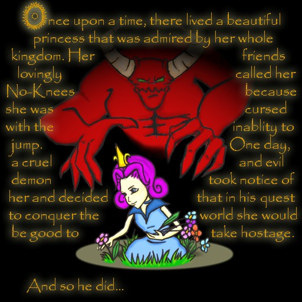 | 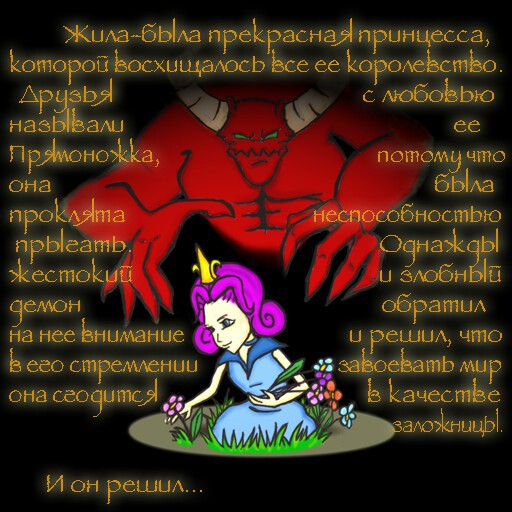 | 
| introscene2 | Alas, poor Princess No-Knees was whisked away to Demon’s lair embedded deep in a mountain. She was imprisoned in a cage with only Demon’s mischievous minion, Impy, to keep her company. The situation appeared impossible, and so No-Knees despaired. Unbeknownst to her, there was someone watching who could help... | Увы, бедная принцесса Прямоножка была отвезена в логово Демона Живое логово глубоко в горах. Она была заключена в клетке, рядом был озорной приспешник Демона, Чертёнок, чтобы составить ей компанию. Ситуация казалась безвыходной, и Прямоножка отчаялась. Но она не знала, что за ней кто-то, кто мог бы помочь... | 
| | 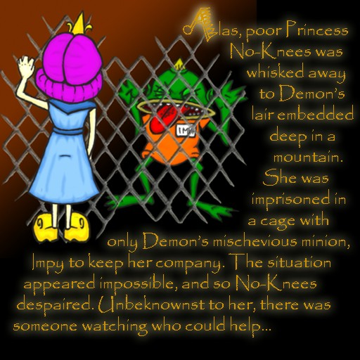 | 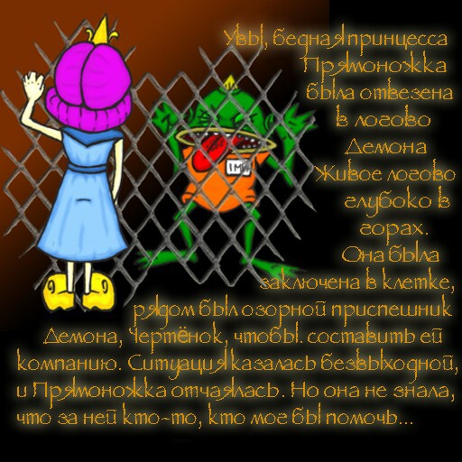 | 
| introscene3 | The spirit of the mountain, Wally, was furious at Demon for creating the lair inside his home. He saw No-Knees, took pity on her, and decided to show himself. He told No-Knees that he would help her escape from the dungeon in exchange for assistance in defeating Demon. And so, Wally revealed his power to open portals in the wall that can break reality. He began to instruct No-Knees on how to use this power to break free... | Дух горы, Уолли, был в ярости на Демона за то, что тот создал логово в его доме. Он увидел Прямоножку пожалел ее и решил показать себя. Он сказал Прямоножке, что поможет ей выбраться из подземелья в обмен на помощь в победе над Демоном. И вот Уолли открыл свою силу открывать порталы в стене, которые могут разрушать реальность. Он начал учить Прямоножку, как использовать эту силу, чтобы вырваться на свободу... | |
| | 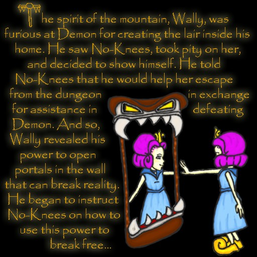 | 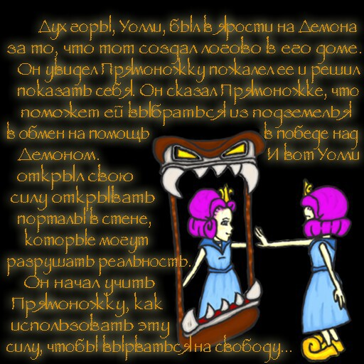 | |
| tutorial1a tutorial1b | Controls(defaults) Looking Zoom In/Out Over-the-shoulder View Look Up - Look Right - Look Left - Look Down First-Person View - Over-the-shoulder View - Third-Person View - Cycle View Moving Forward - Backward  Strafe Left - Strafe Right | Управление (по умолчанию) Осмотр. приблиз. / отдал. Вид из-за плеч. осмотры: Вверх. Вправо, Влево, Вниз. Вид от первого лица. Вид из-за плеч. Вид от третьего лица. Движение. вперед. назад. влево. вправо | 
| | 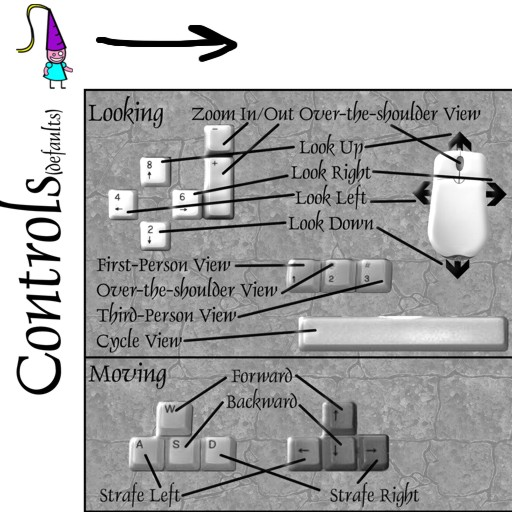 | 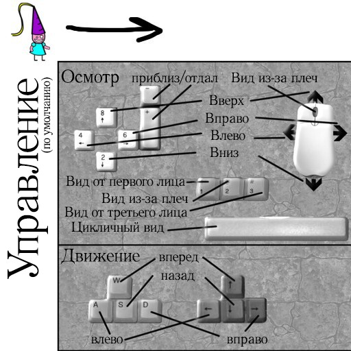 | |
| | 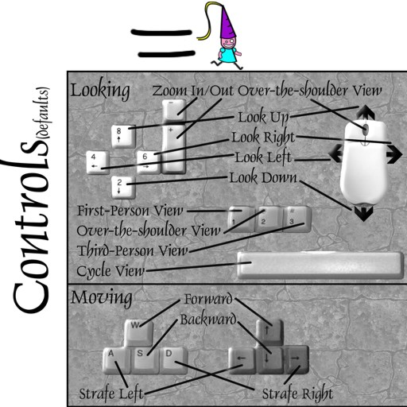 | 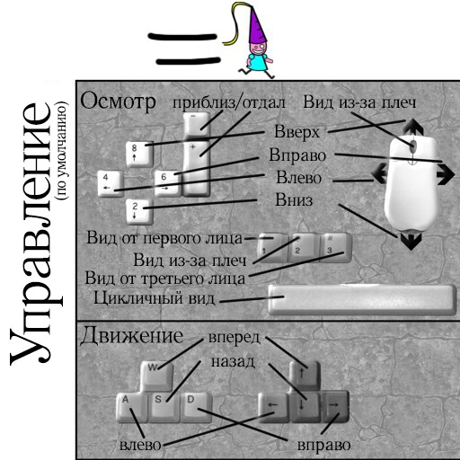 |
| tutorial2a tutorial2b | Portaling Create Red Portal Create Blue Portal (bold to display aim cursor) | Порталы.  Q - создать синий портал. E - создать красный портал. (Удерживайте, чтобы отобразить целевой курсор) | 
| |  | 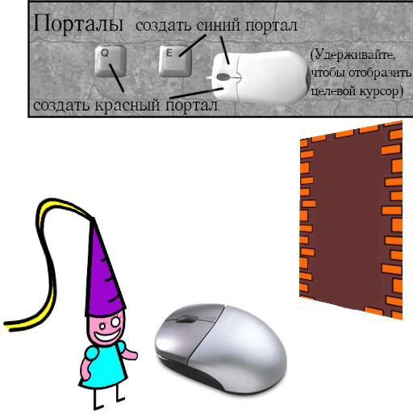 | 
| | 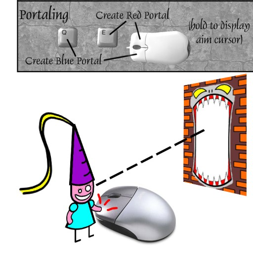 |  | 
| tutorial3a tutorial3b | Portaling Create Red Portal Create Blue Portal (bold to display aim cursor) Eartly - Metallic | Порталы.  Q - создать синий портал. E - создать красный портал. (Удерживайте, чтобы отобразить целевой курсор).  Земляной. Металлический | 
| | 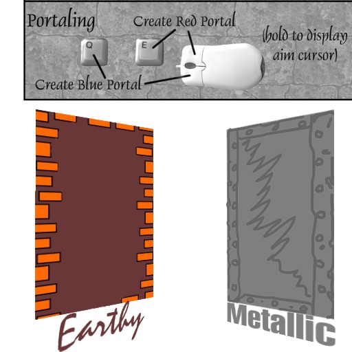 | 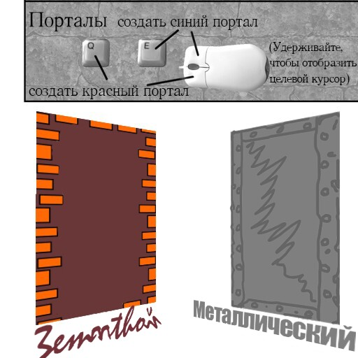 | 
| | 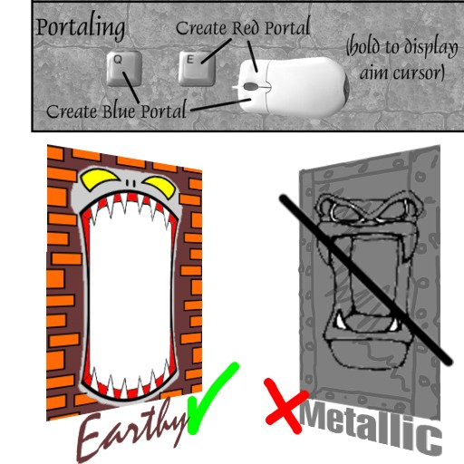 | 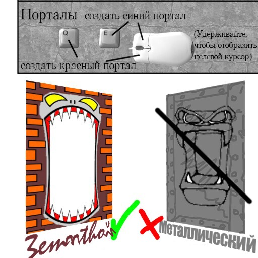 |  | 
| menus | Play Game, Resume, Restart Level Options, Main Menu, Video, Audio Showcase Controls, OK, Cancel Quit, Bit, Volume Color, Depth, Resolution, Music Windowed, Sound Effects, Down Anti-Aliasing Walk Strafe, Turn, Look Left Right, Forward, Backward, Up Portal, Red, Blue. Camera, Fire Cycle View, Zoom, In, Out Moviment, Press a key to bind it.  | Начать игру Возобовить Начать заново Настройки Главное Меню Видео Аудио Демонстрация Контроль ОК Отмена Выход 1632 Бит Громкость Цвет Глубина Разрешение Музыка Оконный Звук эффекты Вниз Сглаживание 1024х768 Идти Стрейф Поворот Взгляд Лево Право Прямо Назад Вверх Портал Оран Голуб Камера Огонь Цикл Вид 123 Приблиз.  Управление нажми кнопку, чтобы привязать | 
| |  | 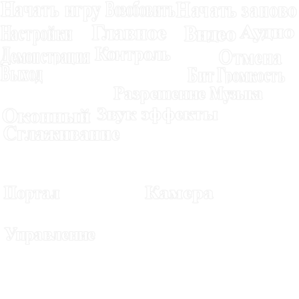 |  | 