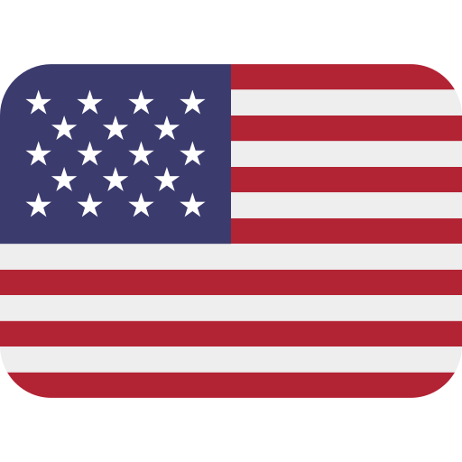

    

#

Esse projeto tem como objetivo traduzir as texturas e os textos de **Narbacular Drop** para outros idiomas que não possuem uma tradução oficial, de maneira comunitária, de fã para fã.

Essas traduções são feitas pela comunidade, este repositório agrega as texturas maneira editável `.psd` e textos traduzidos pela comunidade para o jogo.

Aqui você terá informações do projeto no geral (tradução para outros idiomas) e sobre a tradução em Português (Brasil).

- [Sobre a tradução em português](../PT-BR/Sobre.md)

## Traduções disponíveis
- 🇧🇷 Português (Brasil) - ⬇️ [Baixar tradução](https://github.com/davidmacalister/Community-Translations-for-Narbacular-Drop/releases/download/continuous/Brazilian.7z)
- 🇷🇺 Russo - ⬇️ [Baixar tradução](https://github.com/davidmacalister/Community-Translations-for-Narbacular-Drop/releases/download/continuous/Russian.7z)
## Como colaborarar

* [Documentação](../PT-BR/Documentação.md)

Se você possue conhecimento, você pode traduzir o jogo para o seu idioma, ou melhorar o projeto.

1. **Sugestões de melhorias ou correções**
   * Abra uma *issue* neste repositório.
   * Ou entre em contato via [Discord](https://discord.com/users/1052425195987673108).

2. **Traduções para outros idiomas ou melhorias**
   * Leia a documentação e entre em contato com a equipe caso queira mais orientações.
   * Após validação, sua tradução será adicionada ao projeto com os devidos créditos.

> [!WARNING]
> Este projeto não é afiliado ao instituto de tecnologia DigiPen.

> [!NOTE]
> Este projeto é gerenciado pelo Menino David, então caso tenha alguma dúvida entre contato no meu [Discord](https://discord.com/users/1052425195987673108).

