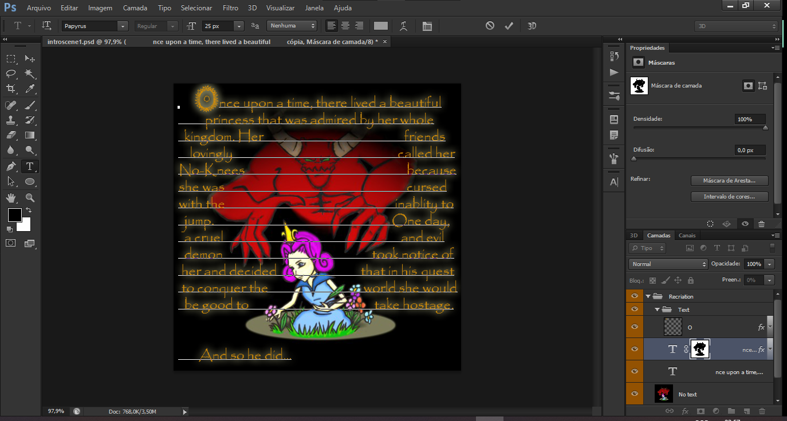

# How to Translate
## Textures
Create a folder for the language you want to translate into at the root of the repository. For example, for Spanish, create the folder `ES` at the root, and inside it create the folders `Compilación` and `Traducido`. Then, copy the `video` folder from `EN/Recriation` into `ES/Traducido`.  

Now open the `.psd` files located in `video/psd` with Photoshop, translate the texture, and save it as `.png` inside `ES/Traducción/video`.

After that, run `compile.bat`. It will transform the `.png` files into `.jpg` with compression almost identical to the original texture.

| Original | Recreated with compression | Recreated without compression |
| -------- | -------------------------- | ----------------------------- |
|  |  |  |

## Texts
Just like with the textures, copy the `levels` folder from `EN/Original` into `ES/Traducido`. The texts are contained inside the maps, located in the `levels` folder. Each `.cfm` map contains the texts that appear in it.  

Open the map you want to edit with Notepad++ (or any text editor of your choice), edit the texts, and save. All of the game’s texts along with the line number and the map in which they appear are listed in [strings](../Strings.md). You can either check the line reference there, or copy the text from the strings file and use `Ctrl+F` to find it.

<strong>Documentation</strong>

  <a href="Fonts.md">← Fonts Used</a>
  &nbsp;&nbsp;&nbsp;|&nbsp;&nbsp;&nbsp;
  <a href="Modding.md">Modifying the Game →</a>

