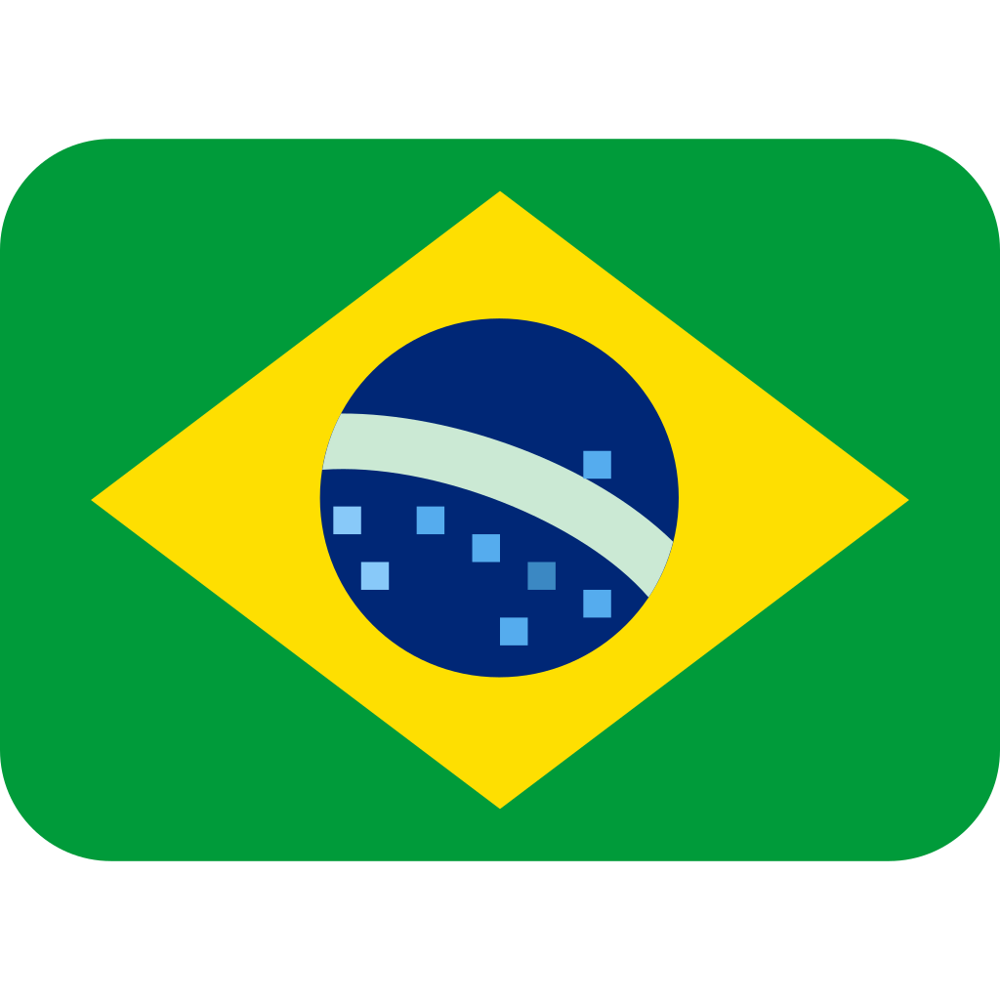

    

#

This project aims to translate the textures and texts of **Narbacular Drop** into other languages that don’t have an official translation, in a community-driven, fan-to-fan way.

These translations are made by the community. This repository gathers the editable `.psd` textures and translated texts for the game.

## Available Translations
- 🇧🇷 Portuguese (Brazil) - ⬇️ [Download translation](https://github.com/davidmacalister/Community-Translations-for-Narbacular-Drop/releases/download/continuous/Brazilian.7z)

- 🇷🇺 Russian - ⬇️ [Download translation](https://github.com/davidmacalister/Community-Translations-for-Narbacular-Drop/releases/download/continuous/Russian.7z)

## How to Contribute

* [Documentation](Docs/Documentation.md)

If you have the knowledge, you can translate the game into your language, or improve the project.

1. **Suggestions for improvements or fixes**
   * Open an *issue* in this repository.
   * Or get in touch via [Discord](https://discord.com/users/1052425195987673108).

2. **Translations into other languages or improvements**
   * Read the documentation and contact the team if you want further guidance.
   * After validation, your translation will be added to the project with proper credits.

> [!WARNING]
> This project is not affiliated with DigiPen Institute of Technology.

> [!NOTE]
> This project is managed by Menino David, so if you have any questions, contact me on [Discord](https://discord.com/users/1052425195987673108).

